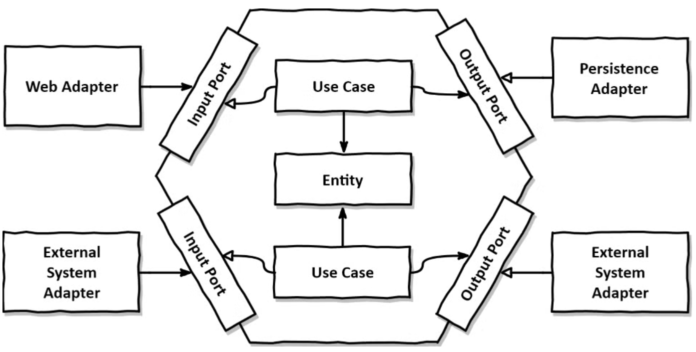

[코드리뷰 해주시는 분들께]
이 docs 파일은 그냥 제가 과제 내용 공부한 거나 찾아본 것중에 기록하고 싶은 거 기록한 거라..
좀 글이 더러울 수 있습니당..ㅎㅎ 이 파일은 가볍게 넘어가주세요..,,

## 필수 과제

1. 조금 더 역할과 책임의 분리를 명확하게 할 수 있는 아키텍처를 적용해주세요.
기본적으로 레이어드 아키텍처를 적용하되 다른 아키텍처에 도전하셔도 됩니다! | ⭐️ |

(1) 우선은 DDD 기반의 계층형 아키텍처를 사용하고자 했다. 일단 지금까지 레이어드 아키텍처만을 적용해왔기에, 다른 아키텍처에 도전해보고 싶었고
DDD 기반의 계층형 아키텍처는 객체지향적인 책임 분리를 가져가는 것에 유리하다.
  - controller로 Presentation 계층을 처리하고(HTTP 요청/응답 처리)
  - service로 Application 계층을 처리하고 (트랜잭션 관리, 유스케이스 조율)
  - domain으로 Domain 계층을 처리하고 (핵심 비즈니스 규칙 및 상태)
  - infratucture로 Infratructure 계층을 처리한다 (DB 구현체, 외부 API 등)
- 우리가 흔히 쓰는 계층형 아키텍처의 경우에는, 모든 비즈니스 로직이 Service 계층에 집중되어 있다.
- 비즈니스 로직의 위치가 전통적 계층형 아키텍처는 Service 계층인 것에 반해, DDD 기반 계층형 아키텍처는 Domain 모델에 있다. (엔티티가 스스로 상태와 규칙을 관리한다)
- 도메인 객체의 역할같은 경우에도 전통적 계층형 아키텍처에서는 단순 데이터 컨테이너 역할을 하지만 (Getter, Setter만 존재하는 상태), DDD 기반 계층형 아키텍처의 경우에는 비즈니스 행위와
규칙을 가진 살아 있는 객체 역할을 한다.
  - DDD 기반 계층형 아키텍처는 핵심 도메인이 자바로 유지되어서 기술 종속성이 적고, 책임이 분산되어 있어서 유지보수성이 좋다는 장점이 있다.

  - 

(2) 근데 이번 기회에 아키텍처 공부.. 를 해보고 싶어서 세미나 과제에서는 헥사고날 아키텍처에 도전하고자 한다. 
  - 객체지향과 의존성 역전 원칙에 대해서 좀 더 깊에 공부해보고 싶었기 때문..
- 헥사고날 아키텍처는 애플리케이션의 핵심 비즈니스 로직을 중앙에 두고 (Domain을 중앙에 두고), 외부 세계 (web, DB 등..) 가 이 중앙을 향해 의존하도록 설계하는 구조이다.
  (의존성 역전!)
  - 그러면.? 기존의 아키텍처에서 뭐가 달라질까? 

  - (지금 하루 넘게 헥사고날 탐방 중인데 그냥 레이어드 아키텍처 쓸 걸..하며 후회 중입니다.. 격하게...)

(2-1) 계층형 아키텍처의 경우에는 위에서 아래로 쌓여있는 형태이고
- Controller > Service > Repository > DB.. 요런 식으로..

(2-2) 헥사고날 아키텍처의 경우에는 둘러싸는 형태이고
- Domain - Application/Ports - Adapters 요런 형태가 될 것 같다
- 그러면 2-1의 아키텍처에 비해 (심화과제)에 들어있는 [HashMap 기반 저장소로 변경] 이나 [서버-클라이언트 분리 및 공통 응답 처리]를 할 때, 핵심 비즈니스 코드를 건드리지 않고 
바깥쪽 어댑터만 갈아끼우거나 추가하면 되는 강력한 유연함을 얻을 수 있다고 한다.!

(2-3) 레이어드 아키텍처 + Repository 인터페이스 요런 형태로 설계하는 방법도 있을 것 같다
Repository 안에 PostReposoitory라는 인터페이스랑 InMemoryPostRepository 라는 구현체를 넣는 형태가 될 것이다
얘는 그대신 입력 쪽 인터페이스가 없을 것이고, 저장소 인터페이스는 repository 패키지에 속할 것이다.

2. 제목과 본문이 비어있는 경우에는 게시글이 작성되지 않도록 제약 조건을 추가해주세요. | ⭐️ |
위에서 헥사고날 아키텍처를 선택하기로 했기 때문에 domain/Post 안에 두는 게 좋을 것 같다
이미 세미나 시간에 작성했던 것처럼 생성과 수정할 때 검증을 거치도록 해야 할거고
몇자 제한 이런 것도 넣으면 좋을 것 같다. Title, Content를 작은 클래스로 만들고 생성자에서 검증하도록 하면
Post는 이미 검증된 제목만 받게 되니까 가벼워져서 좋을 것 같기도..

앞뒤 공백 잘라서 저장 + null이랑 공백 문자열 막고 + 글자수 제한하는 걸로 -> 제약조건을 추가해야겠다

3. 게시글에 더 많은 정보를 추가해주세요.
카테고리(Enum)은 필수이며, 이외에도 게시글에 포함하면 좋을 것 같은 필드를 추가해주세요. | ⭐️ |

-> id, 작성자, 생성일시, 수정일시, 조회수, 좋아요 수 -> 생성 후 바뀔 수 있는 부분 final로 놓기
- 카테고리는 enum으로 만들고, 화면에 보여줄 이름은 필드로 빼기
- 사용자가 입력한 값을 enum으로 바꾸는 거는 카테고리 안에 정적 메서드로 두고 존재하지 않는 카테고리를 사용자가 입력하면 예외 던지기

4. “존재하지 않는 게시글 조회”와 같은 예외를 단순 출력문이 아닌 `Exception` 을 이용한 예외 처리로 변경해주세요. | ⭐️⭐️ |
- domain/Post.java에서 예외 던지고 (빈 제목, 글, 글자수 제한 초과)
- PostService는 스쳐가고 (존재하지 않는 게시글에 예외 던지기)
- adapter/in/PostController에서 잡아서 ApiResponse 실패 응답으로 바꾸고
- client는 그거 보고 메시지 출력하는 걸로.. (여기에서는 입력 형식 검증)

## 심화 과제

1. 역할과 책임의 분리를 더 명확하게 해주세요.
예를 들어 입출력의 분리, 예외 처리, 저장소 관리와 접근의 분리 등에 대해 고민하고 적용해주세요. | ⭐️⭐️⭐️ |

- 입출력은 InputView랑 OutputView로 나누기
- 저장소 추상화란..?
- -> PostRepository는 인터페이스로 두고, 구현체는 MemoryPostRepository로 두기.. Service는 인터페이스만 알게 하기..
- 객체 생성은 main으로 두고, 생성자로 주입받게 구현해보기

2. `List` 로 구현된 게시글 저장소의 조회 성능을 높이기 위해 `HashMap` 을 이용하도록 변경해주세요. 그 과정에서 key로 사용하기 위한 별도의 id 생성 로직을 적용해주세요. | ⭐️⭐️⭐️ |
- Map<Long, Post>를 쓰면 findById가 0(1)이 되는데, 목록 출력할 때 순서를 그대로 되게 하려면..?
- LinkedHashMap이란?
- TreeMap이란.?
- id 생성은 Repository 안에 카운터로 하기..? 동시성을 생각하면 AtomicLong이 좋다고 하는데
- AtomicLong이란.?
- id를 누가 부여할까,,, Repository가 저장할 때 부여? Post를 생성할 때 부여?

3. 서버-클라이언트 구조로 분리되었다는 가정하에 Main과 View가 클라이언트로, 나머지 부분이 서버로 동작하게끔 구현해주세요. | ⭐️⭐️⭐️ |
- DTO로 감싸기~

4. 서버-클라이언트 구조로 분리한 상황에서 클라이언트(Main-View)가 일관된 응답구조를 처리할 수 있도록 공통 응답 객체를 설계하고 적용해보세요. | ⭐️⭐️⭐️ |
- 제너릭 클래스에 성공코드, 메시지, 데이터 담기~
- 성공하면 success(data), exception 경우에는 fail(errorcode)
- @RestControllerAdvice란?

## 키워드 과제

1. `final` / `static` / `static final` 은 각각 어떤 역할을 하며, 차이는 무엇인가요? | ⭐️ |

2. Java의 Generic 타입은 무엇이며 왜 사용할까요?  | ⭐️ |

3. `primitive type` vs `wrapper class` 차이는 무엇이며 어떤 상황에서 무엇을 사용해야 할까요? | ⭐️⭐️ |

4. 여러분이 선택한 아키텍처의 각 요소 또는 계층은 어떤 역할과 책임을 가지는지 구체적으로 설명해주세요. | ⭐️⭐️ |

## 헥사고날 아키텍처에 대해서 구현하면서 신경 쓴 부분
(1) 입력 포트를 얼마나 작게 나눌 것인지
- 하나로 PostUseCase로 두면 파일이 별로 없고, 단순하다는 장점이 있다
- 기능별로 나누면 (작성, 조회, 수정, 삭제) ISP에는 더 충실하지만 파일이 엄청 늘어난다

(2) DTO를 어디에 둘 것인지
- 서비스가 받는 입력은 포트의 일부로 보고, application.port.in에 둘 수 있다
- 클라이언트에게 보여줄 응답 모양은 adapter.in.dto에 둘 수도 있다

(3) id를 누가 만들 것인지
- 출력 어댑터 안에서 만들 것인지, 아니면 정책이라고 보고 별도 출력 포트로 분리해낼지

(4) 예외를 어디에 둘지
- '0자 이상 작성' 이런 도메인 규칙 위반인 경우에는 domain 쪽에 두고, 게시글 없음 같은 애들은 applciation 쪽에서 던지는 게 더 괜찮지 않을까..
- 예외를 ApiResponse 실패로 바꾸는 곳은 adpater.in으로 두는 것이 낫지 않을까

(5) 검증은 어디에 둘지
- 도메인인 Post에 둘지, Service에 둘지.. -> 게시글은 항상 validate이어야 하니까 도메인 규칙이니까 Post에 두기로.
- 공백 거르기 -> by isBlank
